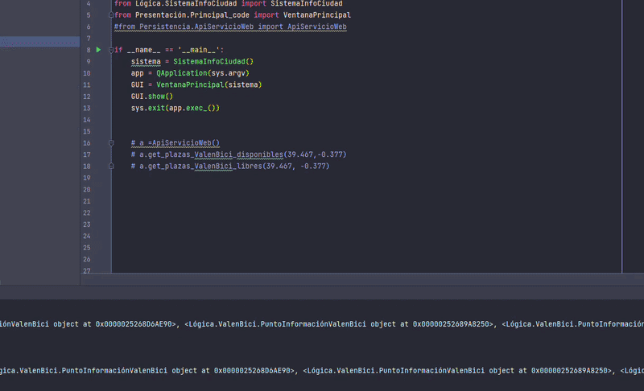

# 🏙️ InfoCiudad

**InfoCiudad** es una aplicación de escritorio desarrollada en **Python** que permite consultar información geográfica y datos en tiempo real de la ciudad de Valencia. La aplicación se conecta a una base de datos local **SQLite** con información sobre monumentos turísticos, parkings, estaciones de Valenbisi, paradas de la EMT y MetroValencia, y combina esta información con los servicios web en tiempo real del **Ayuntamiento de Valencia** para mostrar datos actualizados, junto con mapas interactivos y marcadores de posición.


---



---

## 📑 Tabla de contenidos

- [Funcionalidades](#-funcionalidades)
- [Arquitectura del proyecto](#️-arquitectura-del-proyecto)
- [Estructura del proyecto](#-estructura-del-proyecto)
- [Datos y servicios web](#-datos-y-servicios-web)
- [Instalación y ejecución](#️-instalación-y-ejecución)
- [Tecnologías usadas](#-tecnologías-usadas)
- [Notas](#-notas)
---

## 🚀 Funcionalidades

- 📍 **Gestión de base de datos** con operaciones de creación, búsqueda, modificación y borrado de puntos.
- 🔎 **Geocodificación** de direcciones aproximadas a coordenadas.
- 🌤️ Acceso a **información meteorológica** en un área definida por el usuario alrededor de un punto de interés.
- 🚲 Acceso a **información de Valenbisi** en un área definida por el usuario (disponibilidad y plazas libres).
- 🗺️ Visualización de información en formato de **tablas** y **mapas interactivos**.
---

## 🏗️ Arquitectura del proyecto

La aplicación sigue una **arquitectura en tres capas**:

```
┌──────────────────────────┐
│      Presentación        │
└────────────┬─────────────┘
             │  API: SistemaInfoCiudad, Gestion
┌────────────▼─────────────┐
│          Lógica          │
└────────────┬─────────────┘
             │  API: DataAccessLayer, ApiServicioWeb
┌────────────▼─────────────┐
│        Persistencia      │
└────────────┬─────────────┘
             │
             ▼
            BBDD
```

- **Presentación**: ventanas de interacción con el usuario (formularios, mapas, etc).
- **Lógica**: funcionalidad de la aplicación (puntos de interés, gestión de consultas).
- **Persistencia**: acceso (local/web) y almacenamiento de la información.
---

## 📁 Estructura del proyecto

```
InfoCiudad/
│
├── Database/                                               # Base de datos local
│
├── Logica/                                                 # Lógica de negocio del sistema
│   ├── Gestión de puntos de interés y mapas
│   ├── Modelos del dominio (coordenadas, servicios web)
│   └── Utilidades y configuración
│
├── Persistencia/                                           # Acceso a datos y APIs externas
│
├── Presentacion/                                           # Interfaz gráfica
│   ├── Ventanas principales
│   ├── Diálogos de gestión y búsqueda
│   └── Visualización de mapas
│
├── misc/                                                   # Recursos (gifs, capturas)
├── main.py                                                 # Punto de entrada de la aplicación
├── requirements.txt
└── README.md
```
---

## 🧩 Datos y servicios web

- **Base de datos** local
- **API** de datos abiertos del Ayuntamiento de Valencia
---

## ⚙️ Instalación y ejecución

```bash
git clone https://github.com/jrvalza/InfoCiudad.git
cd InfoCiudad
pip install -r requirements.txt
python main.py
```

Una vez iniciada la aplicación:

1. **Archivo → Conectar base de datos**.
2. **Punto Interés → Buscar** y seleccionar el punto de interés que se usará como centro de la consulta.
3. **Consultar → Mostrar información Meteorológica** o **Consultar → Mostrar estaciones Valenbisi**.
4. Introducir el **radio** (en metros) del área de búsqueda.
5. Se muestran los resultados en una ventana con tabla y mapa interactivo.
---

## 🧠 Tecnologías usadas

| Tecnología | Uso |
|---|---|
| 🐍 Python | Lenguaje principal |
| 🖥️ PyQt / Qt Designer | Interfaz gráfica de usuario |
| 🗄️ SQLite | Base de datos local con elementos de la ciudad |
| 🗺️ Folium / QWebEngineView | Renderizado de mapas interactivos con marcadores |
| 🔎 Nominatim | Geocodificación de direcciones |
---

## 📌 Notas

- ✅ Funcionalidades **implementadas y probadas**: consulta de información meteorológica y consulta de estaciones Valenbisi (plazas libres / bicicletas disponibles) en un área determinada.

- ⚠️ Funcionalidades previstas pero **aún no implementadas**: consulta de parkings, paradas de la EMT, paradas de MetroValencia y monumentos (por área o por ruta predefinida), así como el cálculo de rutas desde la ubicación actual del usuario hasta el elemento seleccionado.

- 🚧 Las consultas de Valenbisi y meteorología dependen de servicios externos. Su disponibilidad y precisión pueden variar según la cobertura de red y el estado de dichos servicios.
- La aplicación está restringida actualmente a los datos abiertos de la ciudad de **Valencia**.

